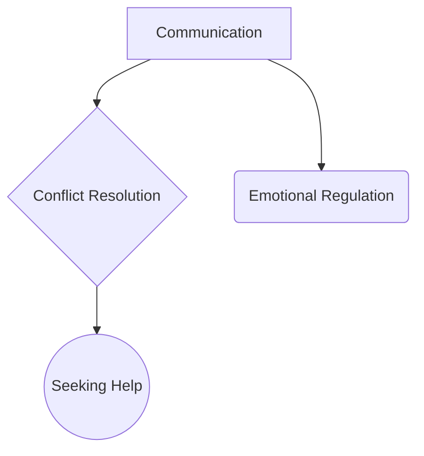

# BeABetterMan
A guide to break the frustrated partner loop

# Graph

```mermaid
graph TD
    A[Communication] --> B{Conflict Resolution}
    A --> C(Emotional Regulation)
    B --> D((Seeking Help))
```    
